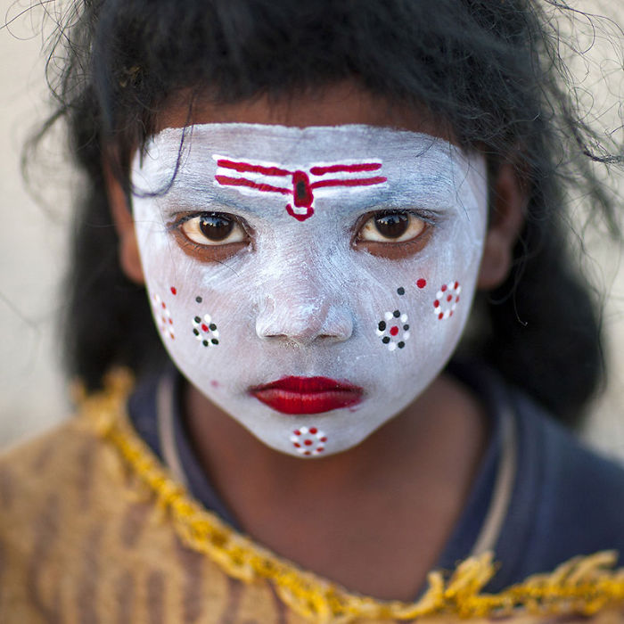

# Top 5 Most Famous Portrait Photographers In The World

There’s something amazing about a good portrait photo – the stunning features of a human, the closeness and raw emotion of the subject in the image and an undeniably perfect composition makes you feel like you know the person as your friend. The power of a portrait is evident in these famous photography shots that we have compiled below.

The best photographers that we’ve chosen for list have taken their portraits around the world without the help of a studio environment. The portrait photography, in this case, seems even more honest and candid, compared to staged pictures, as some of these people might be photographed for the first time in their life. The subjects of these pictures are indigenous people of small tribes from all around the globe and represent a photography branch of travel portraits. This kind of portrait photography is usually done during a trip abroad, documenting the unprivileged and real life, often highlighting the inequalities and social issues.

## 1. Steve McCurry

Steve McCurry is famous for his photo ‘Afghan girl,’ taken in a refugee camp in Peshawar, Pakistan. This photo was named the most recognized photo of National Geographic. His other less famous photos are really worth a look!

## 2. Lee Jeffries

His collection of black and white portraits of homeless people is unique and stunning. He depicts a glimpse of hope in the eyes of his subjects. Simply touching…

## 3. Jimmy Nelsson

Jimmy Nelsson is well-known for his portraits of tribal and indigenous people taken in more than 16 countries. His photos will live to tell the tale. Nelsson’s book is now a collector’s item.

## 4. Rehahn

Rehahn is specially focused on photographing Vietnam, Rajasthan and Cuba. He is famous for catching the soul of his subjects. Rehahn is undoubtedly one of the best portrait photographers in the world.

## 5. Eric Lafforgue

Famous for his photos taken in North Korea, Eric Lafforgue has a story for each person he has photographed. From the tribes of Namibia to the Yezedis of Kurdistan, his tales are fascinating and his photos depict some real emotions.

